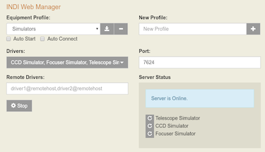
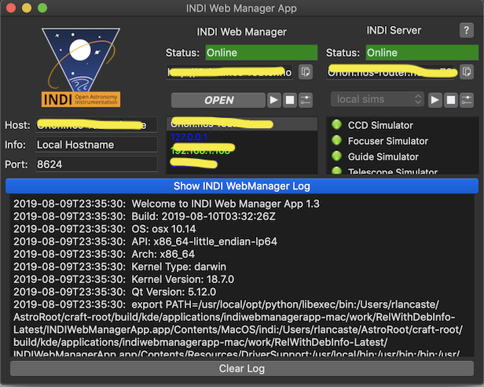
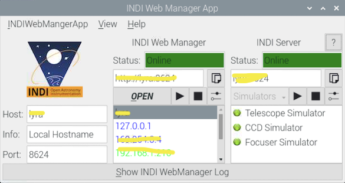
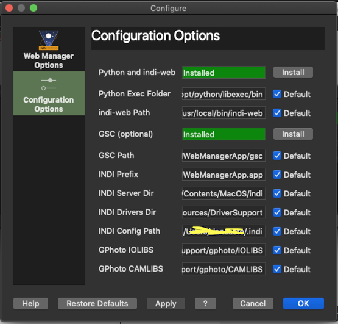
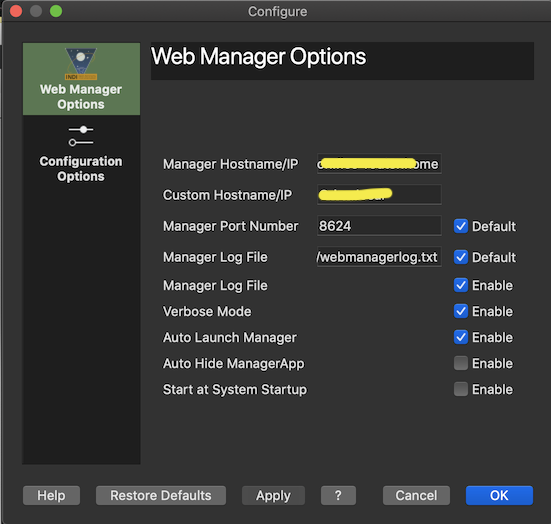

## INDIWebManagerApp
A Graphical program to Manage, Configure, Launch, and Monitor an INDI WebManager on OS X and Linux

###What it does:
- Allows easy and extensive configuration of the options for an INDI Web Manager and an INDI server.
- Makes it easy to set up a Stand alone INDI Server on OS X.
- Allows the setup of an INDI Web Manager on an OS X machine (which was formerly VERY difficult)
- Provides a GUI interface for Starting, Stoping, Accessing, Configuring, and Monitoring an INDI Web Manager and INDI Server on OS X and Linux

### About INDI
[http://www.indilib.org](http://www.indilib.org)

INDI is a protocol for hosting and communicating with astronomical devices on the same computer or on computers on the same network.
It has some similarities to ASCOM on Windows, but can run on more operating systems and over local networks.
An INDI Server can be compiled and run on Linux and OS X, and clients can access it on Linux, OS X, and Windows.
This program is entirely run from the command line, but can also be managed and run by client programs like KStars.

### About INDI Web Manager

[https://github.com/knro/indiwebmanager](https://github.com/knro/indiwebmanager)

A python program called INDI Web Manager was developed by Jasem Mutlaq and Juan Menendez for launching, managing, and remotely starting indiservers.
On Linux this is fairly easy to configure and use, but on OS X it can be pretty complex because there is no package manager and the required 
dependencies are not installed automatically.

### About INDI Web Manager App

This program provides a GUI and many options for configuring, monitoring, launching, and managing an INDI Web Manger on 
both Linux and OS X.  While it is primarily geared toward facilitating the use of an INDI Web Manager on OS X, it also
works well on Linux.  It provides a nice GUI interface to manage the many options and displays the status of the running 
Web Manager and INDI Server.  So it is pretty essential on OS X and can make things more convenient and configurable on Linux.

### Installing INDI Web Manager App on OS X

On OS X, installing the prebuilt INDI Web Manager App is fairly easy.  Just download the DMG, mount it, and drag it to your 
Computer, probably in the Applications folder, but can be put just about anywhere.  The quick start guide runs through many details 
about this program, I would highly recommend reading that.  On the first run, you will have to right click the app and click open
since it is open source software and is unsigned.  Also, since this program relies on having homebrew-based python3 and 
indi-web installed on your computer, these will need to be installed.  There are installers located inside the program in the 
Preferences Dialog.  This should open on first launch when the programs are not detected.  Once these are installed, you should
be good to go.  Another thing you might want to do is install GSC to get stars in the CCD Simulator, but this is optional.
There is also an installer fo that in the Preferences Dialog.

### Installing INDI Web Manager App on Linux

This section of the Readme needs work.  Right now you can build it and run it if the dependencies are met.

### Configuring the paths in the INDI Web Manager on OS X

There are many configuration options for the program.  The INDI Server is embedded in the app bundle on OS X along with all of its dependencies 
and there are a number of environment variables and paths that are updated automatically to make this possible.  The user might also want to 
use an INDI version or one of the dependencies that is installed elsewhere on the computer, such as in homebrew, a craft directory, or in another folder.
This would be the case if the user wants to use a newer/older version of INDI or if the user is building software.  By default the paths point inside
the app bundle and get updated automatically if the app bundle is moved.  But if the user wants to use other paths, these paths can be updated to 
point to the correct folders.  Also, by default this program uses homebrew's python3 and assumes that indiweb will be installed 
in the default Python user directory.  If this is not true, the user can update the paths to reflect the settings on their system such as a different 
version of python or a different Python base user directory.  For many users, these changes will not be required, the default values are fine and they
 can just start it up.

### INDI Web Manager App Options/Preferences

There are a number of settings for INDI Web Manager.  One nice way to use INDI Web Manager app, would be to configure all the settings
appropriately and then configure the INDI Web Manager to automatically start when the program is opened.  You could even add the INDI Web Manager App
to your startup programs on your computer.  This provides a nice way on OS X and Linux to easily set up and configure an INDI Web Manager 
to automatically launch using customized settings and provides a nice way to visually monitor its status while running.

### Building INDI Web Manager App on OS X
[https://github.com/rlancaste/kstars-on-osx-craft](https://github.com/rlancaste/kstars-on-osx-craft)

I have written a script that builds and packages INDI Web Manager App using Craft.  This is in the same repository as my script that
builds and packages up KStars.  Just run the script and follow the directions and it should get all set up.

### Building INDI Web Manger App on Linux.

For Linux, you can clone this repository and build the software.  Editing it in QT Creator would be the preffered method.

